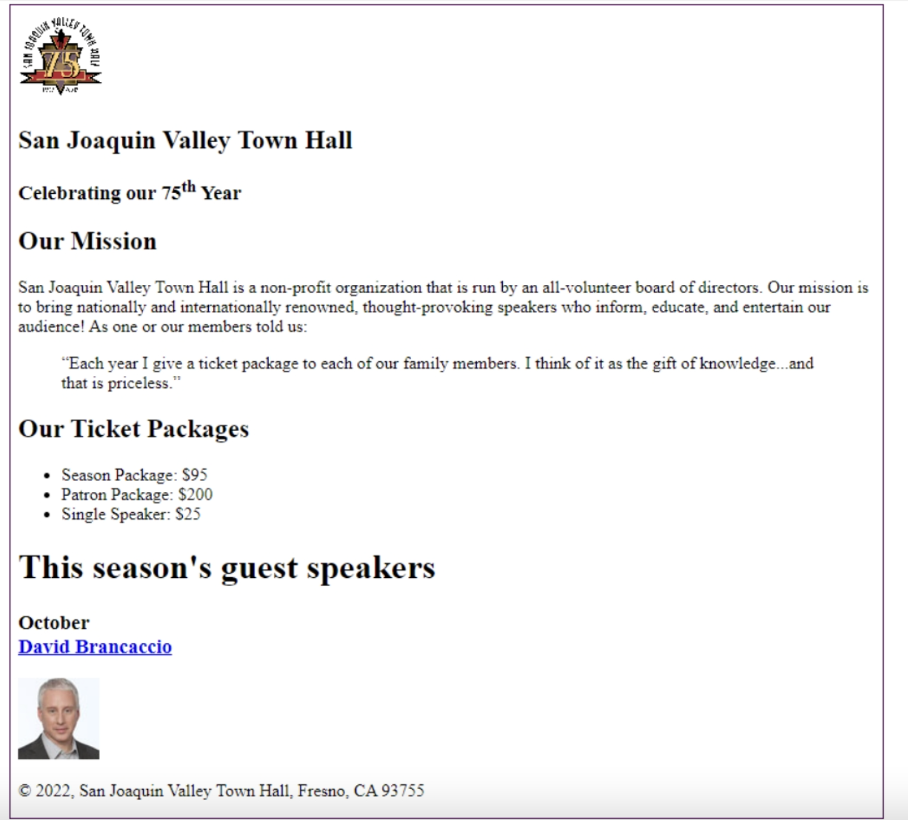

# Instructions

In the exercises for chapters 3 through 8, you’ll develop a new version of the Town Hall website. 




As you develop this site, you will use this folder structure you see in the file explorer to the left. 🤏


This is a realistic structure with images in the images folder, speaker HTML pages in the speakers folder, and CSS files in the styles folder. In addition, the text folder contains text files that will provide all of the content you need for your pages. That too is realistic because a web developer often works with text that has been written by someone else.


# Enter the Header Content
1. Code the img element that gets the image at the top of the page from the images folder. To locate the image file, use this document-relative path: ```images/town_hall_logo.gif```. Be sure to include the ```alt``` attribute, and set the height attribute of the image to ```80```.
2. Apply the``` h2 ```and ```h3``` elements to the text in the header element. Then, test this page in the webview of Replit. If necessary, correct the HTML and check again.

# Enter the Main Content

3.  Copy all of the content for the main element from the txt file into the HTML file. Then, add an ```h1 ```tag to the heading ```“This season’s guest speakers”```, and add``` h2 ```tags to these headings``` “Our Mission” ```and ```“Our Ticket Packages”```.
4. Add ```<p> ```tags to the first block of text after the ```“Our Mission” ```heading, and add blockquote tags to the second block of text as shown above.
5. Add the ```ul ```and ```li``` tags that are needed for the three items after the ```“Our Ticket Packages”``` heading. Then, test these changes and make any adjustments.
6. Format the name and month for the first speaker after the ```“This season’s guest speakers”``` heading as one ```h3``` element with a``` <br>``` in the middle that rolls the speaker’s name over to a second line. Then, test and adjust. When that works, do the same for the next two speakers.
7. Enclose the name for each speaker in an``` <a>``` tag. The href attribute for each tag should refer to a file in the speakers subfolder that has the speaker’s last name as the filename and html as the file extension.
8. After the ```h3 ```element for each speaker, code an ```img ```element that displays the image for the speaker, and be sure to include the``` alt``` attribute. The images are in the images subfolder, and the filename for each is the speak-er’s last name, followed by 75 (to indicate the image size), with ```jpg``` as the extension. Now, test and adjust.

# Add character entities and the remaining formatting tags 
9. Enclose the text in the footer in a``` <p> ```element. And use a character entity to add the copyright symbol to the start of the footer.
10. Add the ```sup ```tags that you need for raising the ```th ```in the second line of the header (as in 75th). Then, test these enhancements.

# Test the links and add a link to one of the speaker pages 
11. Click on the link for the first speaker page. This should display a page that gives the speaker’s name and says ``` “This page is under construction”```. If this doesn’t work, fix the ```href ```attribute in the link and test again. To return to the first page, you can click the browser’s Back button.
12. Open the ```sorkin.html``` file that’s in the speakers subfolder. Then, add a link within a``` <p> ```element that says ```“Return to index page.”``` To refer to the``` index.html ```file, you’ll have to go up one level in the folder structure with a document-relative path like this: ```../index.html```. Now, test this link.
13. Test the index page in the Webview. If necessary fix any problems and test again.
    